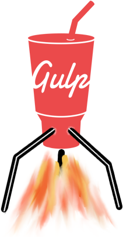

## gulp-runtime [](https://gitter.im/stringparser/gulp-runtime?utm_source=badge&utm_medium=badge&utm_campaign=pr-badge&utm_content=body_badge)

[](https://travis-ci.org/stringparser/gulp-runtime/builds)

[](http://www.npmjs.org/package/gulp-runtime)

<p align="center">
  an alternate interface to
  <a href="https://github.com/wearefractal/vinyl-fs">
    <b>vinyl-fs</b>
  </a>  
</p>
<p align="center">
  <a href="https://github.com/gulpjs/gulp">
    
  </a>
  <h4 align="center" style="border-bottom:0;">
    <a href="./docs">documentation</a>
  </h4>
</p>

## sample

````js
'use strict';

var gulp = require('gulp-runtime').create({repl: true});
var util = require('gulp-runtime/util');
var browserSync = require('browser-sync');

var sass = require('gulp-sass');
var concat = require('gulp-concat');
var webpack = require('gulp-webpack');
var sourcemaps = require('gulp-sourcemaps');
var autoprefixer = require('gulp-autoprefixer');

// configuration options for plugins
//
var opt = require('./gulp-config');

// all js (even if has some jsx)
// webpack takes care of sourcemaps here
//
gulp.task('js', function(){
  return gulp.src('app/**/*.js')
    .pipe(webpack(opt.webpack))
    .pipe(gulp.dest('build'))
    .once('end', browserSync.reload);
});

// sass
//
gulp.task('sass', function(){
  return gulp.src('app/styles/*.scss')
    .pipe(sourcemaps.init())
    .pipe(sass())
    .pipe(autoprefixer())
    .pipe(concat('bundle.css'))
    .pipe(sourcemaps.write('.'))
    .pipe(gulp.dest('build'))
    .once('end', browserSync.reload);
});

// general purpose watch|unwatch
// regex params are in the callback
//
var watching = {};
gulp.task('(watch|unwatch) :glob :tasks((?:\\w+,?)+)', function(next){
  var glob = next.params.glob;
  var watch = next.params[0] === 'watch';
  var tasks = next.params.tasks.split(',');

  if(watch && watching[glob]){
    util.log('Already watching %s', util.log(glob));
  } else if(watch){
    util.log('Watching %s with tasks %s',
      util.color.yellow(glob),
      util.color.cyan(tasks)
    );
    watching[glob] = gulp.watch(glob, tasks);
  }

  if(watching[glob]){
    watching[glob].end();
  } else {
    util.log('no watcher set for `%s`', glob);
    util.log('current globs being watched');
    util.log('-'+ Object.keys(watching).join('\n-'));
  }

  next();
});

// browserSync proxy to server
//
gulp.task('serve', function(next){
  var server = require('./server');
  var port = server._connectionKey.split(':').pop();
  browserSync({
    open: false,
    proxy: 'localhost:'+port
  });
  // reload browser when html files change
  gulp.watch('build/*.html', browserSync.reload);
  // reload require.cache as server files change
  // use browserSync to reload client
  gulp.watch('server/**/*.js', {reload: true}, browserSync.reload);
  next();
});

// gulp.stack returns a function
// calling it will invoke its arguments (string or function)
// strings don't have to be separated by a comma
//
gulp.stack(
  'serve watch app/styles/*.scss sass watch app/js/*.js js',
  {wait: true}
)();
````

## todo

 - [ ] improve the docs

## license

[](http://opensource.org/licenses/MIT)


[x-npm]: https://www.npmjs.org
[x-gulp]: https://github.com/gulpjs/gulp
[x-gulp-cli]: https://github.com/gulpjs/gulp/blob/master/docs/CLI.md

[x-runtime]: https://github.com/stringparser/runtime
[x-through2]: https://www.npmjs.org/package/through2
